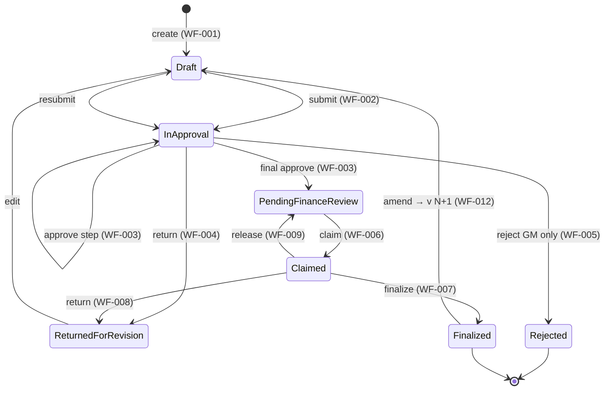
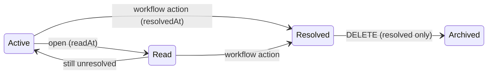

# WORKFLOWS.md — Operational manual (every workflow, end-to-end)

**Purpose:** Let any developer pick a workflow and understand its entire execution path — the
what, the **why**, the failure modes, concurrency, security, rollback, and recovery — **without
hunting through the codebase**. For onboarding, debugging, reviews, and building new features.

**Stable IDs:** every workflow has a permanent **WF-ID** (`WF-001`…). *Reference workflows by
WF-ID, never by section number* — section numbers change, WF-IDs never do.

**Evidence policy (governance):** claims cite `file` / symbol / `file:line`, or ADR/K/BR-id.
Rules are **referenced, not restated** (canonical: `docs/BUSINESS_RULES.md`). State detail:
`docs/state-machines.md`. Invariants: `docs/ARCHITECTURAL_INVARIANTS.md`. Uncertain items **UNKNOWN**.

> **Two honesty notes carried throughout:**
> 1. **No APM / metrics / SLO tooling exists** in the repo (only SQL pool diagnostics in
>    `sql/pool.ts`). So "Metrics" is **UNKNOWN / not implemented**, and response-time targets are
>    **design conventions (unmeasured)**, not measured SLOs.
> 2. Real budget routes are `/api/v1/budget-plans/[id]/...` (Next.js `[id]` segment).

## 📌 Living Documentation Rule (read before changing any workflow)

> **A change to a workflow is NOT complete until the docs are updated in the same task.** This is
> part of the Definition of Done (ADR-013; canonical matrix: `docs/ENGINEERING_GOVERNANCE.md` →
> "Documentation-update matrix"). Minimum obligations:
>
> - **`WORKFLOWS.md`** (this file) — always, for any workflow/step/data-path change.
> - **`BUSINESS_RULES.md`** — if business logic / an invariant changes.
> - **`DATABASE.md`** — if schema (table/index/trigger/constraint) changes.
> - **`ENGINEERING_BRAIN.md`** — if architecture/layering changes.
> - **`KNOWLEDGE_LOG.md`** — if a permanent engineering decision/invariant changes (new immutable K-id).
> - **`CHANGE_HISTORY.md`** — always records the change (with a Rollback line).
>
> If you touch a workflow and skip these, the change is **incomplete**. Documentation here is a
> maintained engineering artifact, not a one-time write-up.

---

## Contents
- [1. Overview, dependency map & WF registry](#1-overview-dependency-map--wf-registry)
- [2. Shared baselines (read once, referenced by every WF)](#2-shared-baselines)
- [Budget authoring — WF-001](#wf-001--budget-creation--draft-edit)
- [Approval — WF-002…WF-005](#wf-002--budget-submission--routing)
- [Finance — WF-006…WF-010](#wf-006--finance-claim)
- [Notifications — WF-011](#wf-011--notification-lifecycle)
- [Amendment — WF-012](#wf-012--budget-amendment)
- [Fiscal year — WF-013](#wf-013--fiscal-year-lifecycle)
- [Administration — WF-014](#wf-014--administration-users--roles)
- [Support — WF-015](#wf-015--support-ticket)
- [Authentication — WF-016](#wf-016--authentication--session)
- [Master data — WF-017](#wf-017--master-data)
- [SAP export — WF-018](#wf-018--sap-export)
- [System — WF-019, WF-020](#wf-019--startup-validation-frozen)
- [14. State diagrams (ASCII + Mermaid)](#14-state-diagrams)
- [15. Common invariants](#15-common-invariants)
- [16. Failure scenarios + ownership](#16-failure-scenarios--ownership)
- [17. Related business rules](#17-related-business-rules)
- [18. Related database tables](#18-related-database-tables)
- [19. Related APIs](#19-related-apis)
- [20. Related tests](#20-related-tests)

**Per-workflow template** (every WF below uses it): Meta header (Version · Updated · Owner ·
Critical · ADR/BR/K) · Purpose · **Why (rationale)** · Roles (Allowed/Denied) · Cross-refs
(Depends on / Continues into) · Trigger · Preconditions · Sequence · State · DB writes ·
Notifications · **Performance** · **Concurrency** · **Security** (delta from Baseline S) ·
**Observability** · **Rollback scope** · **Failures → owner** · **Recovery** · **Checklists** ·
Tests · Evidence.

---

## 1. Overview, dependency map & WF registry

Hierarchical budget-approval platform. Workflows compose into one primary spine plus side
workflows.

**Dependency map (primary spine):**

```
WF-016 Authentication
      │
      ▼
WF-017 Master Data + WF-013 Fiscal Year (Open)   ── prerequisite data
      │
      ▼
WF-001 Budget Creation
      │
      ▼
WF-002 Submission ─► WF-003 Approval ─► WF-006 Claim ─► WF-007 Finalize ─► WF-018 SAP Export
      │                    │  │                              │
      │             WF-004 Return  WF-005 Reject             ▼
      │                                              WF-012 Amendment (new version) ─► WF-002
      ▼
   Reports / Executive rollups
```

**Side workflows:** WF-011 Notifications (produced/resolved by WF-002/003/004/005/006/007/008/009/
010/012/013/014/015) · WF-015 Support · WF-014 Administration · WF-019/WF-020 System.

**WF registry (stable IDs — the source of truth for cross-references):**

| WF-ID | Workflow | Owner subsystem | Service | Critical |
|-------|----------|-----------------|---------|:--------:|
| WF-001 | Budget creation & draft edit | Approval Engine | `BudgetPlanService` | Yes |
| WF-002 | Budget submission & routing | Approval Engine | `ApprovalService.submit` | Yes |
| WF-003 | Hierarchy approval step | Approval Engine | `ApprovalService.approve` | Yes |
| WF-004 | Return for revision | Approval Engine | `ApprovalService.returnForRevision` | Yes |
| WF-005 | Reject (terminal, GM only) | Approval Engine | `ApprovalService.reject` | Yes |
| WF-006 | Finance claim | Finance Workflow | `FinanceService.claim` | Yes |
| WF-007 | Finance finalize | Finance Workflow | `FinanceService.finalize` | Yes |
| WF-008 | Finance return | Finance Workflow | `FinanceService.returnForRevision` | Yes |
| WF-009 | Finance release | Finance Workflow | `FinanceService.release` | Yes |
| WF-010 | Finance SLA escalation | Finance Workflow | `FinanceService.processEscalations` | Med |
| WF-011 | Notification lifecycle | Notification Engine | repos + `notification-task-actions` | Yes |
| WF-012 | Budget amendment | Approval Engine | `BudgetPlanService.createAmendment` | Yes |
| WF-013 | Fiscal year lifecycle | Master Data | `FiscalYearService` | Yes |
| WF-014 | Administration (users/roles) | Master Data | `AdminUserService` | Yes |
| WF-015 | Support ticket | **Retired (MVP)** | Email `ict-support@kengen.co.ke` | — |
| WF-016 | Authentication & session | Authentication & Session Security | auth routes + `session.ts` | Yes |
| WF-017 | Master data | Master Data | `master-data-service.ts` | Yes |
| WF-018 | SAP export | SAP Export | `SapComplianceService` | Yes |
| WF-019 | Startup validation | Startup Validation (**FROZEN**) | `instrumentation.ts` | Yes |
| WF-020 | Development toolkit | Development Toolkit | `DevelopmentToolkitService` | Low |

### 1a. Workflow dependency matrix (the system graph)

Reads as: **Depends on** = must have happened first · **Produces** = the artifact/state it
creates · **Used by** = downstream workflows that consume it.

| WF | Depends on | Produces | Used by |
|----|------------|----------|---------|
| WF-016 Authentication | WF-014 (accounts) | Session cookie + `unreadNotifications` | WF-001…WF-020 (all) |
| WF-017 Master data | WF-016 | Departments / Cost Centres / GL | WF-001, WF-002, WF-014 |
| WF-013 Fiscal year | WF-016 | Open fiscal year | WF-001, WF-002, WF-012 |
| WF-014 Administration | WF-016 | Users + org hierarchy | WF-002 (routing), WF-016 |
| WF-001 Budget creation | WF-016, WF-017, WF-013 | Draft budget (+ lineage v1) | WF-002 |
| WF-002 Submission | WF-001 | `InApproval` + route, or Finance queue (GM) | WF-003, WF-006 |
| WF-003 Approval step | WF-002 | Next Approval task, or Finance queue (final) | WF-003, WF-006, WF-004, WF-005 |
| WF-004 Return | WF-003 | `ReturnedForRevision` + Outcome | WF-001 → WF-002 |
| WF-005 Reject (GM) | WF-003 | `Rejected` (terminal) + Outcome | — (new budget only) |
| WF-006 Finance claim | WF-003 (final) / WF-002 (GM) | `Claimed` + personal FinanceClaim | WF-007, WF-008, WF-009 |
| WF-007 Finance finalize | WF-006 | `Finalized` + frozen SapPackage | WF-018, WF-012 |
| WF-008 Finance return | WF-006 | `ReturnedForRevision` + Outcome | WF-001 → WF-002 |
| WF-009 Finance release | WF-006 | back to `PendingFinanceReview` | WF-006 (re-claim) |
| WF-010 SLA escalation | WF-006 (due dates) | `FinanceEscalation` task | WF-006 (resolves it) |
| WF-011 Notification | any producer WF | Task create/resolve + badge | all producers + WF-016 badge |
| WF-012 Amendment | WF-007 | New Draft version N+1 | WF-002 |
| WF-015 Support | WF-016 | SupportIssue task + Outcome | WF-011 |
| WF-018 SAP export | WF-007 | SAP form download (JSON/CSV/Excel/PDF) | Finance / SAP load |
| WF-019 Startup validation | — (boot) | Serve / refuse-to-serve gate | all (gates runtime) |
| WF-020 Dev toolkit | WF-016 (dev) | Simulated data/state | WF-001…WF-013 (dev only) |

### 1b. Complexity, risk & change-frequency (where to be careful)

At-a-glance reviewer guide. **Complexity** = moving parts; **Risk** = blast radius if wrong;
**Change frequency** = how often this is expected to change (planning signal).

| WF | Complexity | Risk | Change frequency |
|----|-----------|------|------------------|
| WF-001 Budget creation | Medium | Medium | Moderate |
| WF-002 Submission & routing | **High** | **High** | Rarely (routing is ADR-locked) |
| WF-003 Approval step | **High** | **High** | Rarely |
| WF-004 Return | Low | Medium | Rarely |
| WF-005 Reject (GM) | Low | **High** (terminal) | Rarely |
| WF-006 Finance claim | Medium | **High** (exclusivity) | Moderate |
| WF-007 Finance finalize | **High** | **Critical** (freezes SAP, terminal) | Moderate |
| WF-008 Finance return | Low | Medium | Moderate |
| WF-009 Finance release | Low | Medium | Moderate |
| WF-010 SLA escalation | Medium | Medium | Moderate |
| WF-011 Notification | Medium | Medium | **Frequently** |
| WF-012 Amendment | **High** | **High** (+ known audit gap) | Moderate |
| WF-013 Fiscal year | Medium | **High** (period integrity) | Rarely |
| WF-014 Administration | Medium | **High** (hierarchy/RBAC) | Moderate |
| WF-015 Support | Low | Low | Moderate |
| WF-016 Authentication | Medium | **Critical** (security core) | Rarely |
| WF-017 Master data | Low | Medium | Moderate |
| WF-018 SAP export | Medium | **High** (compliance handover) | Moderate (+ flagged smell) |
| WF-019 Startup validation | Medium | **Critical** (boot gate) | **Rarely — FROZEN** |
| WF-020 Dev toolkit | Medium | Low (dev) / **Critical if leaked to prod** | Moderate |

> These ratings are **engineering judgment** from complexity of the code path + governance
> criticality, not measured incident data (none available). Treat as a heat-map, not metrics.

---

## 2. Shared baselines

Documented **once** here and referenced by every WF (entropy control). A WF states only its
*delta* from these.

### Baseline S — Security (applies to every mutating request)
Order of enforcement (defense in depth, ADR-010, BR-38): session cookie verified in
`middleware.ts` → same-origin/CSRF (`same-origin.ts`) → per-IP rate-limit (general/auth/workflow)
→ route-level permission → **service-level authz** (`AuthorizationService`: capability **and**
assignee/ownership) → Zod DTO validation → action → audit (success **and** denial).
- **IDOR protection:** every entity fetch is scoped to the actor (owner / currentApprover /
  claimant / admin); never trust an id from the client alone (BR-43).
- **Sensitive data:** passwords bcrypt-hashed (`passwords.ts`); uniform auth errors (no
  enumeration); secrets never logged; error bodies go through `safe-error-message.ts`.
- **Audit requirement:** every meaningful mutation writes `AuditLogs` (BR-44) — see per-WF
  "Observability". *(WF-012 currently violates this — flagged.)*

### Baseline O — Observability (what "healthy" looks like)
- **Logs:** each API request carries a `correlationId` (UUID); errors flow through
  `readApiError`/`budget-api-error.ts` with a code + correlationId.
- **Audit:** the durable success signal is the `AuditLogs` row(s) listed per WF. If the action
  succeeded but the audit row is missing → treat as a defect.
- **Notifications:** the "work assigned/cleared" signal (per WF).
- **Metrics:** **UNKNOWN / not implemented** — no APM/Prometheus/OTel. Only `sql/pool.ts` exposes
  pool diagnostics + `GET /api/v1/system/database-health`. Treat audit + correlationId logs as the
  observability substrate until a metrics system is added.

### Baseline P — Performance (design conventions, unmeasured)
Every WF is **synchronous** within one HTTP request; persistence is one or a few SQL round-trips
against a pooled connection (`sql/pool.ts`); **no external service calls** on any path. There are
**no measured SLOs** (Baseline O). The "target" quoted per WF is an *aspirational convention*
(simple single-entity writes: tens of ms; multi-write approval/finance actions: low hundreds of
ms on a warm pool) — **verify with real load testing before quoting to stakeholders**.

### Baseline R — Resilience & recovery (infrastructure-level scenarios)
Because every mutation is a single atomic transaction with no partial commit (Baseline RB), these
common failures are safe:
- **User closes browser / power outage mid-request:** the transaction either committed or it
  didn't; no half-done state. On reconnect the UI reflects the true persisted state.
- **Back button / stale page:** a re-issued mutating action hits optimistic-concurrency or a
  uniqueness guard and is rejected (see per-WF Concurrency); reads are idempotent.
- **Duplicate submit (double-click / retry):** guarded by status checks + unique indexes +
  optimistic version → the second attempt fails cleanly (`409 BUDGET_CONFLICT` or a state error),
  never double-applies.
- **SQL restart / transient DB error:** `sql-retry.ts` retries transient errors on a fresh pooled
  connection; unrecoverable errors surface as `500` (not a false `401` — K-007).
- **Session expiry:** protected routes return `401`; UI redirects to `/login`; re-auth resumes
  from true persisted state (no work lost, nothing partially applied).

### Baseline T — Transaction boundary & repository chain (verified against code)
**Every mutating service method runs inside a single transaction** via
`uow.runInTransaction(async () => { … })` (`ApprovalService`, `FinanceService`,
`BudgetPlanService`, `FiscalYearService`, `AdminUserService`, `MasterDataService`,
`SupportIssueService`, `DevelopmentToolkitService` — all confirmed).

**The boundary (SQL driver — `SqlUnitOfWork`, `sql/index.ts:1232`):**
```
runInTransaction(fn)
  │  BEGIN TRAN  (mssql Transaction stored in AsyncLocalStorage: txStorage)
  ▼
  fn() runs — EVERY repo call inside resolves its request from txStorage
  (sql/request.ts:sqlRequest → txRequest(ctx)), so ALL writes share the transaction:
     ├─ domain/business writes (BudgetPlans, ApprovalSteps, FinanceQueueClaims, SapPackages, …)
     ├─ WorkflowHistory (append)
     ├─ AuditLogs (append)            ← INSIDE the transaction, before commit
     └─ Notifications (create/resolve) ← INSIDE the transaction, before commit
  ▼
  COMMIT  (only after fn() returns successfully)         ── on any throw → ROLLBACK
```
So **notifications and audit are written *inside* the transaction, not after commit.** If any
step (including a notification insert) throws, the whole unit rolls back — nothing is committed.
Nested `runInTransaction` reuses the active transaction (`sql/index.ts:1235`).

**Caveat — driver difference:** `MockUnitOfWork.runInTransaction` just calls `fn()` with **no real
rollback** (`mock/index.ts:548`) — in-memory mutations already applied are *not* reverted on error.
**True atomicity is a SQL-driver guarantee only**; mock is for tests/dev.

**Full repository chain (fastest debugging map — there is NO separate controller layer):**
```
UI (React page/form)
  ↓  fetch
API route handler  = the "controller"  (src/app/api/v1/**/route.ts: Zod DTO + permission)
  ↓
Application service  (uow.runInTransaction — business rules + AuthorizationService)
  ↓
Domain entity / rule  (pure invariants)
  ↓
Repository INTERFACE  (I*Repository)   →   SQL impl (Sql*)  |  Mock impl (Mock*)
  ↓                                          ↓ sqlRequest() → txStorage-bound request
SQL Server tables (one transaction)      in-memory store (no txn)
```

### Baseline RB — Rollback principle (and where rollback is impossible)
- **In-request failure → full transaction rollback → no partial state** (no orphan drafts, no
  half-advanced approvals) — **SQL driver only** (see Baseline T caveat for mock).
- **Rollback is IMPOSSIBLE for already-committed history.** `AuditLogs`, `ApprovalHistory`,
  `WorkflowHistory` are append-only and immutable (INV-6/7/8, BR-45). You **cannot** delete a
  prior step's audit trail — corrections are **compensating actions** (e.g. Return/Amend), which
  themselves add new immutable rows. This is deliberate: the trail must show what actually happened.

### Baseline FI — Failure injection ("what if SQL dies here?")
Because of Baseline T, most in-request failures have one uniform, safe answer. Reference this from
each WF instead of restating.

| Injected failure | When | Result (SQL driver) |
|------------------|------|---------------------|
| DB dies **before** any write | start of `fn()` | nothing written; request → 500; state unchanged |
| Business/domain write succeeds, **next write throws** (e.g. notification insert fails) | mid-`fn()` | **whole transaction ROLLS BACK** — the earlier write is undone; e.g. WF-006 the budget does **not** remain claimed |
| All writes succeed, **COMMIT fails** (connection drop at commit) | commit | transaction not committed → effectively rolled back; client sees 500; safe to retry |
| Transient error (deadlock/timeout) | any request | `sql-retry.ts` (`withRetryOnRequest`) retries on a fresh pooled request; if still failing → 500 |
| Process/pod killed mid-transaction | any | uncommitted transaction is aborted by SQL Server on connection loss → no partial state |
| **Mock driver**, mid-`fn()` throw | tests/dev | ⚠ **no rollback** — earlier in-memory mutations persist; do not rely on mock for atomicity assertions |

**Rule of thumb:** for any WF, "what if it dies at step N?" → *the transaction rolls back to before
step 1* (SQL). The only irreversible facts are already-committed immutable history rows from
*prior, separate* successful transactions (Baseline RB).

### Baseline C — Global checklists (each WF lists only deltas)
- **Developer:** business rule in domain/service (not route/UI) · Zod DTO + domain validation ·
  authz = capability + assignee/ownership · audit + history on mutation · atomic multi-write ·
  loading/empty/error UI · TS+ESLint clean · unit test.
- **QA:** happy path · each negative case in the WF's "Failures" table · concurrency case ·
  permission denied for each Denied role · audit row present · notification created/resolved ·
  badge correct.
- **Manual UAT:** log in as the Allowed role, perform the action in the browser, verify the state
  change + notification + audit entry, and confirm a Denied role cannot (proof points 11–12,
  `docs/staging-e2e-acceptance.md`).

---

## WF-001 — Budget creation & draft edit

**Meta:** Version 1 · Updated 2026-07-18 · Owner Approval Engine · Maintainer `BudgetPlanService`
· Critical **Yes** · ADR-005/006 · BR-01..12, BR-31 · K-002/K-003.

**Purpose:** Let a Budget Holder author/edit a budget for their cost centre + fiscal year while it
is still theirs to change.

**Why (rationale):** budgets must be owned and editable only by the responsible person and only
before they enter approval, so accountability is unambiguous and an in-flight approval can't be
silently altered underneath approvers (hence the `Draft`/`ReturnedForRevision`-only edit window).

**Roles:** Allowed — **Budget Holder** (owner of the CC). Denied — Manager, GM, Finance,
SystemAdmin (no create/edit on someone else's CC; SystemAdmin has no budget visibility, K-005).

**Cross-refs:** Depends on WF-016, WF-017, WF-013. Continues into **WF-002**.

**Trigger:** `/budgets/create` → Save draft (or `?edit=<id>` → Update).

**Preconditions:** authenticated · `budget.create` · owns CC (`costCenterId ===
actor.primaryCostCenterId`) · FY Open · no active version in lineage.

**Sequence:**
```
Holder ─► POST /api/v1/budget-plans (or PATCH .../[id])
 ▼ route: Zod DTO + permission(budget.create)
BudgetPlanService.createDraft/updateDraft
 ├ isBudgetType · validateHeader/Lines (Money/PeriodRange) · assertCanEditDraft+assertNotLocked · assertNoActiveInLineage
 ▼
BudgetRepository ─► BudgetPlans (+ BudgetLineage on v1)
 ├─► WorkflowHistory (Draft/Created)   ├─► AuditLogs (CreatedDraft)   └─► CostCenterSubmissionStatus (→InProgress)
 ▼ response: saved draft (no notification)
```

**State:** create → `Draft`; edit stays `Draft`/`ReturnedForRevision` (`EDITABLE_BUDGET_STATUSES`).

**DB writes:** `BudgetPlans` INSERT/UPDATE (`Status`, lines, `Version`); `BudgetLineage` INSERT
(v1); `WorkflowHistory` INSERT; `AuditLogs` INSERT; `CostCenterSubmissionStatus` projection.

**Notifications:** none (no outstanding work created yet).

**Performance:** convention tens-of-ms (single-entity write). Writes: `BudgetPlans` (+lineage,
history, audit). One transaction. No external services. *(unmeasured — Baseline P)*

**Concurrency:** optimistic — `BudgetPlans.Version`/`RowVersion`; a stale edit → `409
BUDGET_CONFLICT` (`ConcurrencyConflictError`). First writer wins; second re-reads and retries.

**Security (Δ from Baseline S):** owner-only + own-CC scope is the IDOR control; `budget.create`.

**Observability:** log correlationId; audit `CreatedDraft` (denials `DraftCreateDenied`/
`DraftEditDenied`); no notification; metrics UNKNOWN.

**Rollback scope:** DB — full rollback on failure (no partial draft). App — stateless.
Notifications — none. Audit — `CreatedDraft` only written on success (nothing to undo). Impossible?
No irreversible step here.

**Failures → owner:**
| Symptom | Code | Likely subsystem | Owner |
|---|---|---|---|
| Not owner / other CC | 403 | AuthorizationService | Approval Engine |
| Active version exists | ActiveBudgetConflict | `BudgetPlanService` | Approval Engine |
| FY not Open | FY_NOT_OPEN | `assertPlanFyOpen` | Master Data (FY) |
| Locked status edit | BudgetLockedError | domain invariants | Approval Engine |
| Stale write | 409 BUDGET_CONFLICT | repo/version | Approval Engine |
| Amount ≤ 0 | VALIDATION | `Money.create`/`CK_BudgetItems_Amount` | Approval Engine |

**Recovery:** fix validation & re-save; if now locked, path forward is WF-012 (post-finalize) or
await WF-004 (return). Infra scenarios → Baseline R.

**Checklists (Δ):** Dev — verify lineage guard fires; QA — create second active version must fail
(BR-08); UAT — a non-owner cannot open the edit form.

**Tests:** `active-budget-conflict.test.ts`, `concurrency-and-retry.test.ts`, `budget-api-error.test.ts`.

---

## WF-002 — Budget submission & routing

**Meta:** Version 1 · Updated 2026-07-18 · Owner Approval Engine · Maintainer `ApprovalService`
· Critical **Yes** · ADR-002/007 · BR-02, BR-05, BR-14..18 · K-004.

**Purpose:** Submit a valid draft and build its approval route by walking `Users.managerId` to the
GM root; a GM submitter's empty route goes straight to Finance.

**Why (rationale):** routing by the live org tree (not hardcoded titles/stages) means the workflow
survives reorgs with zero code change (ADR-002). A GM has no one above them, so an "empty route →
Finance" is correct — forcing a GM to click "approve" on their own budget would be a fake step
(ADR-007), not real authority.

**Roles:** Allowed — **Budget Holder** (owner). Denied — everyone else (submit is owner-only).

**Cross-refs:** Depends on **WF-001**. Continues into **WF-003** (normal route) or **WF-006**
(GM empty-route → finance queue).

**Trigger:** budget detail "Submit" → `POST /api/v1/budget-plans/[id]/submit`.

**Preconditions:** owner · `budget.submit` · ≥1 valid line · SAP cost-centre code set · FY Open ·
no active duplicate in lineage · resolvable hierarchy to a GM root.

**Sequence:**
```
Holder ─► POST .../[id]/submit
 ▼ ApprovalService.submit (via BudgetPlanService.submit)
 ├ assertCanSubmit · assertPlanFyOpen · validateBudgetLines · assertSapCodeForSubmit · duplicate-active check
 ├ buildApprovalRoute(owner, usersById, cc.managerId)  → walk managerId → GM(managerId=null)
 ▼
 ├ normal ─► Status=InApproval, currentApproverId=step[0]
 │    ├─► ApprovalRoutes/ApprovalSteps INSERT ├─► WorkflowHistory+AuditLogs (Submitted/Resubmitted)
 │    └─► Notification: Approval → first approver (targetUrl /budgets/{id}?action=approve; dedup K-009)
 └ empty (GM) ─► Status=PendingFinanceReview, enterFinanceQueue ─► notifyFinanceQueue → FinanceQueue to finance admins
```

**State:** `Draft|ReturnedForRevision → InApproval` (normal) or `→ PendingFinanceReview` (GM empty).

**DB writes:** `BudgetPlans` (`Status`, `CurrentApproverId`, `SubmittedAt/By`); `ApprovalRoutes`/
`ApprovalSteps` INSERT; `WorkflowHistory`+`AuditLogs` (`Submitted`/`Resubmitted`); `Notifications`.

**Notifications:** normal → `Approval` to first approver; GM empty → `FinanceQueue` fan-out.

**Performance:** convention low-hundreds-ms (route build + multi-insert). Writes: plan, route,
steps, history, audit, notification. One transaction. No external services.

**Concurrency:** submitting an already-submitted plan → state guard rejects (not `InApproval`
→ denied). Optimistic version guards concurrent edit+submit → `409 BUDGET_CONFLICT`. Duplicate
double-submit → second sees non-draft status and fails.

**Security (Δ):** owner-only; `budget.submit`; route is computed server-side from `managerId`
(client cannot inject approvers — IDOR-safe).

**Observability:** audit `Submitted`/`Resubmitted` (denial `SubmitDenied`); notification to
approver/finance; metrics UNKNOWN.

**Rollback scope:** DB — full rollback (no route/steps if it fails). App — stateless.
Notifications — created only on commit. Audit — `Submitted` on success. Impossible? No.

**Failures → owner:**
| Symptom | Code | Likely subsystem | Owner |
|---|---|---|---|
| Submit twice / not owner / FY closed / invalid / no SAP code | SubmitDenied / VALIDATION | `ApprovalService`/domain | Approval Engine |
| Broken/circular hierarchy | route error (fail-closed) | `buildApprovalRoute` | Approval Engine |
| No GM root | GM_MISSING | `buildApprovalRoute` | Master Data (users) |
| Stale edit vs submit | 409 BUDGET_CONFLICT | repo/version | Approval Engine |

**Recovery:** fix the blocking condition (add line/SAP code, open FY, fix hierarchy) and resubmit.
Hierarchy gaps are fixed in WF-014.

**Checklists (Δ):** Dev — assert empty-route GM path sets `PendingFinanceReview`, not a self-approve;
QA — submit with broken hierarchy must fail closed; UAT — approver receives an Approval task that
deep-links to the Decision panel.

**Tests:** `build-approval-route.test.ts`, `authorization-scopes.test.ts`, `e2e:spine`.

---

## WF-003 — Hierarchy approval step

**Meta:** Version 1 · Updated 2026-07-18 · Owner Approval Engine · Maintainer `ApprovalService`
· Critical **Yes** · ADR-002/003 · BR-19/20, BR-37 · K-004.

**Purpose:** The current approver advances the budget one step up the chain; the final step hands
it to Finance.

**Why (rationale):** only the person the route currently points at may act, and never the owner —
this enforces separation of duties so a budget can't be self-approved or approved out of order.

**Roles:** Allowed — the **current approver** (Manager or GM) with `budget.approve`. Denied —
the owner (even if they're an approver elsewhere), any non-current approver, Finance, SystemAdmin.

**Cross-refs:** Depends on **WF-002**. Continues into **WF-003** (next step), **WF-006** (final →
finance), or branches to **WF-004**/**WF-005**.

**Trigger:** `/approvals` or budget Decision panel → `POST /api/v1/budget-plans/[id]/approve`.

**Preconditions:** plan `InApproval` · `actor.id === currentApproverId` · `budget.approve` · not
owner · FY Open.

**Sequence:**
```
Approver ─► POST .../[id]/approve
 ▼ ApprovalService.approve ─► assertCurrentApprover (InApproval, actor==current, not owner) · assertPlanFyOpen
 ├ intermediate ─► stays InApproval, advance currentApproverId
 │     ├─► ApprovalHistory(ApprovedStep)+AuditLogs ├─► resolve actor's Approval task └─► new Approval task → next approver
 └ final ─► Status=PendingFinanceReview, currentApproverId=null, enterFinanceQueue
       ├─► ApprovalHistory(ApprovedToFinance)+AuditLogs ├─► resolve all Approval tasks └─► notifyFinanceQueue → finance admins
```

**State:** `InApproval → InApproval` (advance) or `→ PendingFinanceReview` (final).

**DB writes:** `BudgetPlans` (`Status`, `CurrentApproverId`); `ApprovalSteps` (step status);
`ApprovalHistory` INSERT (immutable); `WorkflowHistory`+`AuditLogs`; `Notifications`.

**Notifications:** resolve actor's `Approval`; intermediate → new `Approval` to next; final →
resolve all + `FinanceQueue` fan-out.

**Performance:** convention low-hundreds-ms. Writes: plan, step, history, audit, notifications. One
transaction. No external services.

**Concurrency (important):** two approvers acting at once, or a double-click — the check
`actor.id === currentApproverId` + optimistic version means **exactly one succeeds**; the other
gets `409 BUDGET_CONFLICT` or a "not current approver" `403`. The chain can never advance twice.

**Security (Δ):** `assertCurrentApprover` is both the authz and the IDOR control (id from client is
re-validated against the plan's `currentApproverId`).

**Observability:** audit `ApprovedStep`/`ApprovedToFinance`; task resolve + create; metrics UNKNOWN.

**Rollback scope:** DB — full rollback of the step transition on failure. App — stateless.
Notifications — resolve/create only on commit. Audit — **the prior approved steps are immutable
(Baseline RB): you cannot "un-approve" step 1; you Return/Reject instead.** Impossible? Un-doing a
committed approval is impossible — use WF-004/WF-005.

**Failures → owner:**
| Symptom | Code | Likely subsystem | Owner |
|---|---|---|---|
| Non-current approver acts | 403 | `assertCurrentApprover` | Approval Engine |
| Owner approves own | 403 | `assertCurrentApprover` | Approval Engine |
| Concurrent approve | 409 BUDGET_CONFLICT | repo/version | Approval Engine |
| Notification not created | (silent) | Notification Repository | Notification Engine |

**Recovery:** if stuck (e.g. approver inactive), WF-014 reassignment / hierarchy fix re-points the
route; there is no "skip" — routing is by `managerId`.

**Checklists (Δ):** Dev — assert final step triggers `notifyFinanceQueue`; QA — concurrent approve
yields exactly one success; UAT — approving advances to the next named approver.

**Tests:** `authorization-scopes.test.ts`, `e2e:spine`.

---

## WF-004 — Return for revision

**Meta:** Version 1 · Updated 2026-07-18 · Owner Approval Engine · Maintainer `ApprovalService`
· Critical **Yes** · ADR-003 · BR-21/22/23 · K-004.

**Purpose:** Send a budget back to the owner for edits (recoverable), with a required reason.

**Why (rationale):** "return" is the recoverable counterpart to "reject". Keeping them distinct
means a budget needing tweaks isn't permanently killed, and the audit trail clearly separates
"needs work" from "closed". Manager or GM may return; the reason is mandatory so the owner knows
what to fix.

**Roles:** Allowed — **Manager** or **GM** who is the current approver (`canReturnBudget` = org
role manager|gm + `budget.approve`). Denied — Budget Holder, Finance, SystemAdmin.

**Cross-refs:** Depends on **WF-003** (in-approval). Continues into **WF-001** (edit) → **WF-002**
(resubmit).

**Trigger:** Decision panel "Return" → `POST /api/v1/budget-plans/[id]/return` `{reason}`.

**State:** `InApproval → ReturnedForRevision`; pending route steps `Pending → Invalidated`.

**DB writes:** `BudgetPlans` (`Status`); `ApprovalSteps` invalidated; `ApprovalHistory`
(`ReturnedForRevision`)+`AuditLogs`; `Notifications`.

**Notifications:** resolve the actor's `Approval`; `Outcome` FYI → `plan.ownerId` ("returned").

**Performance:** convention low-hundreds-ms; one transaction; no external services.

**Concurrency:** same as WF-003 — only the current approver acts; concurrent action → one wins,
other `409`/`403`.

**Security (Δ):** `canReturnBudget` + current-approver check; reason required (validation).

**Observability:** audit `ReturnedForRevision` (denial `ReturnDenied`); Outcome to owner; metrics UNKNOWN.

**Rollback scope:** DB — full rollback on failure. Audit — the return is itself an immutable record
(Baseline RB). Impossible? Cannot un-return; the owner resubmits to move forward.

**Failures → owner:**
| Symptom | Code | Owner |
|---|---|---|
| Non-approver returns | ReturnDenied/403 | Approval Engine |
| No reason | VALIDATION | Approval Engine |

**Recovery:** owner edits (WF-001) and resubmits (WF-002) — a fresh route is built.

**Checklists (Δ):** QA — returned budget becomes editable again; UAT — owner sees the reason.

**Tests:** `authorization-scopes.test.ts`, `e2e:spine`.

---

## WF-005 — Reject (terminal, GM only)

**Meta:** Version 1 · Updated 2026-07-18 · Owner Approval Engine · Maintainer `ApprovalService`
· Critical **Yes** · ADR-003 · BR-21/22/23 · **K-004**.

**Purpose:** Permanently close a budget. Terminal — no resubmit.

**Why (rationale):** permanent rejection is the strongest authority, reserved for the org apex
(GM). Finance deliberately **cannot** reject — this is K-004 and the reason WF-005 is GM-only.
*Rejected alternative — "Finance can reject" (canonical: `docs/REJECTED_DECISIONS.md`):*
- would **bypass GM governance** (Finance overriding the approval chain after GM approval);
- would create **conflicting audit ownership** (two terminal authorities on one budget);
- would **complicate amendment lineage** (which terminal state does an amendment descend from?).
- **Decision:** Finance may **Return** (WF-008) or **Finalize** (WF-007) only.

**Roles:** Allowed — **GM** only (`canRejectBudget` = org role gm + `budget.reject`). Denied —
Manager, Budget Holder, Finance, SystemAdmin.

**Cross-refs:** Depends on **WF-003**. Continues into: nothing (terminal). Recovery is a *new*
budget/lineage.

**Trigger:** Decision panel "Reject" → `POST /api/v1/budget-plans/[id]/reject` `{reason}`.

**State:** `InApproval → Rejected` (terminal); pending steps `→ Invalidated`.

**DB writes:** `BudgetPlans` (`Status=Rejected`); `ApprovalSteps` invalidated; `ApprovalHistory`
(`Rejected`)+`AuditLogs`; `Notifications`.

**Notifications:** resolve `Approval`; `Outcome` FYI → owner ("rejected").

**Performance / Concurrency / Security:** as WF-004, but capability is `budget.reject` + org-role
GM; reason required.

**Observability:** audit `Rejected` (denial `RejectDenied`); Outcome to owner; metrics UNKNOWN.

**Rollback scope:** DB — full rollback on failure. Audit — immutable (Baseline RB). Impossible?
**Yes — reject is terminal and cannot be undone.** Recovery = create a new budget (new version/
lineage).

**Failures → owner:**
| Symptom | Code | Owner |
|---|---|---|
| Manager attempts reject | RejectDenied/403 (GM-only) | Approval Engine |
| No reason | VALIDATION | Approval Engine |

**Checklists (Δ):** QA — Manager cannot reject; only GM can; UAT — rejected budget offers no
resubmit control.

**Tests:** `authorization-scopes.test.ts`.

---

## WF-006 — Finance claim

**Meta:** Version 1 · Updated 2026-07-18 · Owner Finance Workflow · Maintainer `FinanceService`
· Critical **Yes** · ADR-004 · BR-24/25/26 · K-004.

**Purpose:** A Finance officer takes exclusive ownership of a queued budget.

**Why (rationale):** without an exclusive claim, two officers could process the same budget in
parallel and produce conflicting SAP handovers. One active claim per plan makes ownership
unambiguous and auditable.

**Roles:** Allowed — **FinanceAdministrator** (`finance.claim`). Denied — Budget Holder, Manager,
GM, SystemAdmin (SystemAdmin may only *release/reassign*, WF-009).

**Cross-refs:** Depends on **WF-003** (final) or **WF-002** (GM empty). Continues into **WF-007**/
**WF-008**/**WF-009**.

**Trigger:** `/finance` "Claim" → `POST /api/v1/budget-plans/[id]/finance/claim`.

**State:** `PendingFinanceReview → Claimed` (set `financeClaimedBy`, due dates).

**DB writes:** `FinanceQueueClaims` INSERT (`IsActive=1`); `BudgetPlans` (`Status`,
`FinanceClaimedBy`); `WorkflowHistory`+`AuditLogs`; `Notifications`.

**Notifications:** resolve shared `FinanceQueue`+`FinanceEscalation`; create personal
`FinanceClaim` (claimant) + `Finance` FYI → owner.

**Performance:** convention low-hundreds-ms; one transaction; no external services.

**Concurrency (important):** two officers claim at once → **exactly one succeeds**; the other gets
`ALREADY_CLAIMED`. Hard backstop: `UX_FinanceQueueClaims_ActivePlan` (mig 007) — even a race that
passes the app check fails at the unique index.

**Security (Δ):** `finance.claim`; claim record ties the plan to `actor.id`.

**Observability:** audit `FinanceClaimed`; queue task resolved, personal task created; metrics UNKNOWN.

**Rollback scope:** DB — full rollback (no claim row) on failure. Notifications — on commit only.
Audit — immutable. Impossible? No — a claim is undone by WF-009 release.

**Failures → owner:**
| Symptom | Code | Likely subsystem | Owner |
|---|---|---|---|
| Already claimed | ALREADY_CLAIMED | `FinanceService.claim` / `UX_FinanceQueueClaims_ActivePlan` | Finance Workflow |
| Not finance | 403 | AuthorizationService | Finance Workflow |

**Recovery:** if claimed by mistake → WF-009 release. Infra → Baseline R.

**Checklists (Δ):** QA — concurrent claim → exactly one wins; UAT — claimed budget disappears from
others' queue.

**Tests:** `finance-release.test.ts`, `e2e:spine`.

---

## WF-007 — Finance finalize

**Meta:** Version 1 · Updated 2026-07-18 · Owner Finance Workflow · Maintainer `FinanceService`
· Critical **Yes** · ADR-004/008 · BR-26/27/28 · K-004.

**Purpose:** The claimant completes review: status `Finalized` and an **immutable SAP package** is
frozen.

**Why (rationale):** finalize is the point of no return where the budget becomes the official
record and the SAP handover is frozen. Freezing a package (rather than exporting live) preserves an
immutable record of exactly what was handed over, independent of SAP availability.

**Roles:** Allowed — the **claimant** FinanceAdministrator (`finance.finalize` + `assertClaimant`).
Denied — non-claimant finance officers, everyone else.

**Cross-refs:** Depends on **WF-006**. Continues into **WF-018** (SAP export) and enables **WF-012**
(amendment).

**Trigger:** `/finance/sap/[id]` "Finalize" → `POST /api/v1/budget-plans/[id]/finance/finalize`.

**State:** `Claimed → Finalized` (terminal success).

**DB writes:** `BudgetPlans` (`Status=Finalized`); `SapPackages` INSERT (immutable,
`UQ_SapPackages_BudgetPlan`, `sapReference=buildSapReference(...)`); `BudgetLineage`
(`latestFinalizedVersionId`); `FinanceQueueClaims` (`IsActive=0`); `WorkflowHistory`+`AuditLogs`;
`Notifications`.

**Notifications:** resolve all finance task types; `Outcome` → owner + managers + actor.

**Performance:** convention low-hundreds-ms (multi-table write incl. SAP freeze). Writes:
`BudgetPlan`, `SapPackages`, `BudgetLineage`, claim, history, audit, notifications. **Single SQL
transaction. No external services.** *(unmeasured — Baseline P.)*

**Concurrency:** only the claimant finalizes (`assertClaimant`); a concurrent release+finalize race
is resolved by the claim state + optimistic version. `UQ_SapPackages_BudgetPlan` guarantees exactly
one package even under retry.

**Security (Δ):** claimant-only (`assertClaimant`) is authz + IDOR control; `finance.finalize`.

**Observability:** audit `FinanceFinalized`; SAP package row created; Outcome notifications;
metrics UNKNOWN.

**Rollback scope:** DB — **all tables commit together or none** (atomic): on failure no status
change, no SAP package, no lineage pointer. App — stateless. Notifications — on commit only. Audit
— immutable. Impossible? Once committed, finalize is not reversible in place — the forward path is
**WF-012 amendment** (new version), never editing the finalized version.

**Failures → owner:**
| Symptom | Code | Likely subsystem | Owner |
|---|---|---|---|
| Non-claimant finalize | FinanceClaimantDenied | `assertClaimant` | Finance Workflow |
| Finalize non-Claimed | INVALID_STATE | `FinanceService.finalize` | Finance Workflow |
| Duplicate SAP package | UQ violation (guarded) | `UQ_SapPackages_BudgetPlan` | SAP Export |

**Recovery:** to change a finalized budget → WF-012. Accidental finalize has no undo (Baseline RB);
create an amendment.

**Checklists (Δ):** Dev — assert atomic freeze (package + status + lineage); QA — finalize twice →
second fails; non-claimant → denied; UAT — finalized budget is read-only and SAP form downloads.

**Tests:** `finance-audit.test.ts`, `sap-download-auth.test.ts`, `e2e:spine`.

---

## WF-008 — Finance return

**Meta:** Version 1 · Updated 2026-07-18 · Owner Finance Workflow · Maintainer `FinanceService`
· Critical **Yes** · ADR-004 · BR-24/26 · **K-004**.

**Purpose:** Finance sends a claimed budget back for revision (Finance's *only* rejection-like
lever).

**Why (rationale):** Finance validates compliance but must not override the approval chain by
killing a budget; returning preserves the revise-and-resubmit path (see WF-005 rationale, K-004).

**Roles:** Allowed — the **claimant** (`finance.return` + `assertClaimant`). Denied — others.

**Cross-refs:** Depends on **WF-006**. Continues into **WF-001** → **WF-002**.

**Trigger:** `POST /api/v1/budget-plans/[id]/finance/return` `{reason}`.

**State:** `Claimed → ReturnedForRevision`.

**DB writes:** `BudgetPlans` (`Status`, clear claim); `FinanceQueueClaims` (`IsActive=0`);
`WorkflowHistory`+`AuditLogs` (`FinanceReturned`); `Notifications`.

**Notifications:** resolve finance task types; `Outcome` → owner.

**Performance / Concurrency / Security:** as WF-007 minus SAP freeze; claimant-only.

**Rollback scope:** DB full rollback on failure; audit immutable; Impossible? cannot un-return.

**Failures → owner:** non-claimant → `FinanceClaimantDenied` (Finance Workflow); no reason →
VALIDATION.

**Recovery:** owner edits/resubmits.

**Checklists (Δ):** QA — returned budget editable; **Finance has no "reject" control anywhere**.

**Tests:** `finance-release.test.ts`, `e2e:spine`.

---

## WF-009 — Finance release

**Meta:** Version 1 · Updated 2026-07-18 · Owner Finance Workflow · Maintainer `FinanceService`
· Critical **Yes** · ADR-004 · BR-26.

**Purpose:** Return a claimed budget to the shared queue (unclaim).

**Why (rationale):** claims shouldn't strand a budget if the officer is unavailable; release
(by the claimant, or SystemAdmin for reassignment) puts it back so any officer can pick it up.

**Roles:** Allowed — the **claimant** or **SystemAdmin** (reassignment). Denied — other finance
officers, non-admins.

**Cross-refs:** Depends on **WF-006**. Continues into **WF-006** (re-claim).

**Trigger:** `POST /api/v1/budget-plans/[id]/finance/release`.

**State:** `Claimed → PendingFinanceReview` (clear `financeClaimedBy`).

**DB writes:** `FinanceQueueClaims` (`IsActive=0`); `BudgetPlans` (clear claim);
`WorkflowHistory`+`AuditLogs` (`FinanceReleased`); `Notifications`.

**Notifications:** resolve personal `FinanceClaim`; **re-fan-out** shared `FinanceQueue` to finance
admins.

**Concurrency:** releasing an already-released plan → no active claim → no-op/denied; safe.

**Security (Δ):** `assertClaimant` OR SystemAdmin reassignment (`FinanceReleaseDenied` otherwise).

**Rollback scope:** DB full rollback; audit immutable; Impossible? No (re-claimable).

**Failures → owner:** non-claimant/non-admin release → `FinanceReleaseDenied` (Finance Workflow).

**Recovery:** any finance admin re-claims (WF-006).

**Checklists (Δ):** QA — released plan reappears in the shared queue for all officers.

**Tests:** `finance-release.test.ts`.

---

## WF-010 — Finance SLA escalation

**Meta:** Version 1 · Updated 2026-07-18 · Owner Finance Workflow · Maintainer
`FinanceService.processEscalations` · Critical **Medium** · BR-29 · domain `finance-sla.ts`.

**Purpose:** Flag overdue finance claims/reviews and raise a critical escalation task.

**Why (rationale):** budgets stuck in finance must surface, or they silently miss the cycle;
escalation makes SLA breaches visible to all finance admins.

**Roles:** system process (invoked via escalations endpoint / dev toolkit). Recipients:
FinanceAdministrators.

**Cross-refs:** Depends on **WF-006** (due dates set at claim/enter-queue).

**Trigger:** `processEscalations` sweep (on demand via `GET /api/v1/finance/escalations` / dev
toolkit). **Standalone scheduler: UNKNOWN / not confirmed in-repo.**

**State:** sets `EscalationStatus` `None → Warning → Escalated` on the plan.

**DB writes:** `BudgetPlans` (`EscalationStatus`); `Notifications` (`FinanceEscalation`, Critical).

**Notifications:** `FinanceEscalation` → finance admins; resolved when the plan is claimed (WF-006).

**Performance:** batch sweep over overdue plans; convention proportional to overdue count; no
external services.

**Concurrency:** idempotent — re-running does not duplicate (a plan already `Escalated` isn't
re-escalated; notification dedup K-009 keeps one active `FinanceEscalation`).

**Security (Δ):** endpoint requires `finance.view`; the sweep itself is server-side.

**Rollback scope:** DB — status flag; audit; Impossible? No (cleared on claim).

**Failures → owner:** escalation not raised → check due-date computation (`computeFinanceDueDates`)
/ sweep invocation — Finance Workflow; **no scheduler configured** would mean it only runs
on-demand (UNKNOWN).

**Recovery:** claim the plan (WF-006) to resolve; adjust due dates via `finance-sla.ts`.

**Checklists (Δ):** QA — overdue plan gets exactly one `FinanceEscalation`; re-sweep doesn't
duplicate.

**Tests:** `finance-escalations.test.ts`.

---

## WF-011 — Notification lifecycle

**Meta:** Version 2 · Updated 2026-07-18 · Owner Notification Engine · Maintainer repos +
`notification-task-actions` · Critical **Yes** · **K-001/K-009** · BR-33..37 · migrations 010/011.

**Purpose:** Model outstanding **work as tasks** (not messages); active until the work is done for
that recipient.

**Why (rationale):** message-feed notifications let users clear alerts without doing the work, so
work fell through the cracks. Tasks that only resolve on the real workflow action (read ≠ resolve;
badge counts *work*) keep the to-do list truthful.

**Roles:** every role (as recipients); services (as producers).

**Cross-refs:** produced/resolved by WF-002/003/004/005/006/007/008/009/010/012/013/014/015.

**Model:** `Notification` (`entities/index.ts:267`). Actionable = `Approval, FinanceQueue,
FinanceClaim, FinanceEscalation, SupportIssue, FiscalYear`; informational = `Outcome, Finance,
Amendment, AdminUser`.

**Sequence:**
```
Producer ─► create task (dedup: INSERT ... WHERE NOT EXISTS, K-009)
User ─► POST /api/v1/notifications?action=read&id=  (readAt set) ─► badge UNCHANGED (read≠resolve)
     ─► navigate targetUrl (deep-link) ─► perform real action (WF-003/007/…)
that action ─► resolveForPlan/resolveForEntity (resolvedAt+resolvedBy) ─► Active→History, badge −1
```

**State (per task):** `Active → Read(still active) → Resolved → Archived (resolved only)`.

**DB writes:** `Notifications` INSERT (guarded) / UPDATE `readAt` / UPDATE `resolvedAt,resolvedBy`
/ DELETE (resolved only).

**Performance:** convention tens-of-ms; per-user reads via `listByUser`; badge from `GET /me`.

**Concurrency:** duplicate active actionable task creation → atomic guard keeps exactly one (K-009);
concurrent read/resolve are idempotent (setting an already-set timestamp is a no-op).

**Security (Δ):** every query scoped to `user.id` (a user can only read/act on their own
notifications — IDOR-safe); `DELETE` refuses unresolved (BR-35).

**Observability:** the badge (`unreadNotifications`) is the health signal; a lingering task after
work is done ⇒ a producer missed its `resolveFor…` call; metrics UNKNOWN.

**Rollback scope:** notification writes are part of the producing action's transaction — roll back
with it (no orphan tasks). Archive (DELETE) is only over resolved rows. Impossible? No.

**Failures → owner:**
| Symptom | Likely subsystem | Owner |
|---|---|---|
| Notification not created | Notification Repository (`create`) | Notification Engine |
| Duplicate active task | dedup guard bypassed | Notification Engine |
| Task lingers after work done | producing service missed `resolveFor…` | that workflow's owner |
| Delete unresolved refused | by design (BR-35) | Notification Engine |

**Recovery:** fix the producing workflow's resolve call (not manual deletion). Historical
duplicates (pre-guard) are not auto-removed (CHANGE_HISTORY #011).

**Checklists (Δ):** Dev — every new producer resolves its task at the terminal step; QA — read
doesn't change the badge; duplicate creation no-ops; UAT — bell shows active tasks and deep-links.

**Tests:** `notification-dedup.test.ts`, `notification-read-lifecycle.test.ts`,
`notification-dismiss.test.ts`, `amend-notifications.test.ts`.

---

## WF-012 — Budget amendment

**Meta:** Version 1 · Updated 2026-07-18 · Owner Approval Engine · Maintainer
`BudgetPlanService.createAmendment` · Critical **Yes** · ADR-005 · BR-06/08/13/31 · K-002.
**⚠ Known defect:** does not write `AuditLogs` (BR-44 gap) — flagged, `ENGINEERING_BRAIN.md` §17.

**Purpose:** Controlled change to a finalized budget — a new version in the same lineage.

**Why (rationale):** finalized budgets are immutable records (for SAP/compliance), but real
budgets need mid-cycle changes; amendments give a governed way to change while preserving the
finalized history as a distinct version.

**Roles:** Allowed — **Budget Holder** (owner, `budget.create`). Denied — others.

**Cross-refs:** Depends on **WF-007** (finalized parent). Continues into **WF-002**.

**Trigger:** budget detail "Create Amendment" → `POST /api/v1/budget-plans/[id]/amend` `{reason}`.

**Preconditions:** parent == lineage `latestFinalizedVersionId` · no active version in lineage · FY
Open · owner + own CC · no lineage version `Claimed`.

**State:** new plan → `Draft` (`parentBudgetPlanId`, `lineageRevision=parent+1`); prior stays
`Finalized`.

**DB writes:** `BudgetPlans` INSERT; `BudgetLineage` (`currentVersionId`); attachments inherited;
`WorkflowHistory` (`AmendmentCreated`). **AuditLogs: NONE — defect.**

**Notifications:** `Amendment` FYI → actor's manager + finance admins (excluding actor).

**Performance:** convention low-hundreds-ms; one transaction; no external services.

**Concurrency:** blocked while a lineage version is `Claimed` (`BudgetLockedApiError`); second
active version → `ActiveBudgetConflict` (BR-08); optimistic version guards concurrent amend.

**Security (Δ):** owner-only + own CC; amend only from the latest finalized (server-checked).

**Observability:** WorkflowHistory `AmendmentCreated`; **missing audit row is the known gap** —
until fixed, amendment is under-audited vs Baseline S/BR-44; metrics UNKNOWN.

**Rollback scope:** DB — new version + lineage pointer + attachments + notification commit together
or none. Audit — **none currently written (defect)**; the finalized parent is untouched. Impossible?
No (the new draft can be abandoned/returned).

**Failures → owner:**
| Symptom | Code | Owner |
|---|---|---|
| Amend non-latest/non-finalized | rejected | Approval Engine |
| Amend while Claimed | BudgetLockedApiError | Approval Engine |
| Second active version | ActiveBudgetConflict | Approval Engine |
| Missing audit row | **defect (BR-44)** | Approval Engine |

**Recovery:** the amendment draft is editable/resubmittable (WF-001/WF-002).

**Checklists (Δ):** Dev — **add the missing `AuditLogs` write when the flagged defect is
scheduled**; QA — cannot amend from a non-latest version; UAT — amendment appears as version N+1.

**Tests:** `amend-owner.test.ts`, `amend-notifications.test.ts`.

---

## WF-013 — Fiscal year lifecycle

**Meta:** Version 1 · Updated 2026-07-18 · Owner Master Data · Maintainer `FiscalYearService`
· Critical **Yes** · **K-006** · BR-30/31/32 · migrations 003/006.

**Purpose:** Manage budgeting periods; exactly one Open and one Current year; raise a closure task
when the current flag leaves a still-open year.

**Why (rationale):** budget work must target a single unambiguous period; allowing two open years
would let parallel, conflicting budget cycles exist. The closure task nudges admins to actually
close the year they've moved past.

**Roles:** Allowed — **SystemAdmin** (`fy.manage`). Denied — all others.

**Cross-refs:** Enables **WF-001/WF-002/WF-012** (FY must be Open). Produces **WF-011** tasks.

**Trigger:** `/admin/fiscal-years` → open / `PATCH .../[id]` {close|reopen|archive|setCurrent}.

**State:** `Open ↔ Closed`, `Closed → Archived`, `Archived → Open`; `isCurrent` orthogonal
(`isLocked = status !== "Open"`).

**DB writes:** `FiscalYears` INSERT/UPDATE; `AuditLogs`
(`FinancialYearOpened/SetCurrent/Closed/Reopened/Archived`); `Notifications`.

**Notifications:** set-current off an open prior year → `FiscalYear` (High) → active SystemAdmins;
closing that year auto-resolves (`resolveForEntity("FiscalYear", id)`).

**Performance:** convention tens-of-ms; one transaction; no external services.

**Concurrency:** opening/setting a second Open/Current → blocked by app + `UX_FiscalYears_OneOpen`/
`UX_FiscalYears_OneCurrent` (exactly one wins under a race).

**Security (Δ):** `fy.manage`; SystemAdmin only.

**Observability:** audit per action; closure task lifecycle; metrics UNKNOWN.

**Rollback scope:** DB full rollback on failure; audit immutable; Impossible? No (reopen archived).

**Failures → owner:**
| Symptom | Code | Owner |
|---|---|---|
| Second Open year | blocked/UX violation | Master Data |
| Illegal transition | rejected | Master Data |
| Budget work vs non-Open FY | assertPlanFyOpen fail | Master Data |

**Recovery:** reopen (`Archived → Open`); close the prior year to clear the closure task.

**Checklists (Δ):** QA — cannot open two Open years; closure task auto-resolves on close.

**Tests:** covered via master-data/notification suites; **dedicated `fiscal-year-service.test.ts`
UNKNOWN (not located)** — coverage gap.

---

## WF-014 — Administration (users & roles)

**Meta:** Version 1 · Updated 2026-07-18 · Owner Master Data · Maintainer `AdminUserService`
· Critical **Yes** · ADR-007/010 · BR-17/39/40/43 · K-005/K-008.

**Purpose:** Provision/manage users, roles, and the org hierarchy that drives routing.

**Why (rationale):** approval routing walks `managerId`, so hierarchy integrity is a hard
requirement — hence guards against self-management, circular chains, and removing the last GM/admin/
role-holder or a manager with reports/pending approvals.

**Roles:** Allowed — **SystemAdmin** (`admin.users`). Denied — all others. (SystemAdmin is *not*
an approver, K-005.)

**Cross-refs:** Enables **WF-002/WF-003** (hierarchy) and **WF-016** (accounts).

**Trigger:** `/admin` users → `POST/PATCH /api/v1/admin/users[...]`, `.../activate`,
`.../reset-password`.

**State:** no workflow status; `active` boolean toggled.

**DB writes:** `Users` INSERT/UPDATE; `AuthTokens` (reset); `AuditLogs`
(`UserCreated/Updated/Activated/Deactivated/PasswordReset`); `Notifications` (create only).

**Notifications:** create → `AdminUser` FYI → other active SystemAdmins.

**Performance:** convention tens-of-ms; validation is in-memory over the user set; one transaction.

**Concurrency:** guards (`LAST_ADMIN`/`LAST_ROLE_HOLDER`) re-checked at write; concurrent
deactivation of the last admin → one succeeds, the other fails the guard.

**Security (Δ):** `admin.users`; passwords hashed at route (`hashPassword`+`checkPasswordPolicy`);
`SELF_LOCKOUT` prevents an admin removing their own access.

**Observability:** audit per action; `AdminUser` FYI on create; metrics UNKNOWN.

**Rollback scope:** DB full rollback; audit immutable; Impossible? No.

**Failures → owner:**
| Symptom | Code | Owner |
|---|---|---|
| Deactivate last admin/GM/role-holder | LAST_ADMIN/LAST_ROLE_HOLDER | Master Data |
| Self lockout | SELF_LOCKOUT | Master Data |
| Deactivate w/ reports/approvals | HAS_DIRECT_REPORTS/HAS_PENDING_APPROVALS | Master Data |
| Two active GMs | blocked (BR-17) | Master Data |

**Recovery:** reassign reports/approvals before deactivation; re-activate via activate.

**Checklists (Δ):** QA — every guard rejects; UAT — new user can log in (WF-016) and route resolves.

**Tests:** `admin-user-service.test.ts`.

---

## WF-015 — Support ticket

**Meta:** Version 1 · Updated 2026-07-18 · Owner Notification Engine · Maintainer
`SupportIssueService` · Critical **Medium** · BR-36/37.

**Purpose:** Any user reports an issue; routed to SystemAdmins as an actionable task until resolved.

**Why (rationale):** support requests are *work* for admins, so they belong in the task model, not
a message feed — they stay active until resolved, then notify the reporter of the outcome.

**Roles:** Allowed — **any authenticated user** (create); **SystemAdmin** (list-all/update). Denied
— non-admins for list-all/update; non-reporter/non-admin for get.

**Cross-refs:** Produces **WF-011** tasks.

**Trigger:** report modal → `POST /api/v1/support-issues`; admin `PATCH .../[id]`.

**State (`SupportIssueStatus`):** `Open → Assigned → InProgress → Resolved → Closed` (`closedAt`
on Resolved/Closed).

**DB writes:** `SupportIssues` INSERT/UPDATE (`UX_SupportIssues_Reference`); `AuditLogs`
(`SupportIssueCreated/Updated`); `Notifications`.

**Notifications:** create → `SupportIssue` → SystemAdmins; resolve/close → resolve those +
`Outcome` → reporter.

**Performance / Concurrency / Security:** convention tens-of-ms; validation (title ≥3, desc ≥10,
category/priority, screenshot ≤5MB); create = authenticated, update = `assertAdmin`, get = reporter
or admin (IDOR control).

**Rollback scope:** DB full rollback; audit immutable; Impossible? No.

**Failures → owner:** invalid input → VALIDATION; non-admin update/list → 403 (Notification
Engine).

**Recovery:** admin reopens by setting status back.

**Checklists (Δ):** QA — reporter gets Outcome on resolve; non-admin cannot list all.

**Tests:** `support-issue-service.test.ts`.

---

## WF-016 — Authentication & session

**Meta:** Version 1 · Updated 2026-07-18 · Owner Authentication & Session Security · Maintainer
auth routes + `session.ts` · Critical **Yes** · ADR-010 · BR-38/40/41/47/48 · K-007.

**Purpose:** Authenticate an admin-provisioned user, issue a signed session, expose current user +
badge; deny safely otherwise.

**Why (rationale):** enterprise credential model — accounts are admin-provisioned (no public
register/reset) and the frontend is never the security boundary; a login that succeeds but `/me`
that 401s indicates a config/schema mismatch, which must surface as 500 (not a misleading 401) so
it's diagnosable (K-007).

**Roles:** Allowed — any user (login); authenticated user (logout, me). Denied — inactive /
no-password / unverified-email accounts.

**Cross-refs:** Gates every other WF. Depends on **WF-014** (accounts).

**Trigger:** `/login` → `POST /api/v1/auth/login`.

**Sequence:**
```
User ─► POST /api/v1/auth/login {email,password}
 ├ findAuthUserByEmail ─► uniform invalid-credentials (no enumeration)
 ├ reject inactive / PASSWORD_NOT_SET(403) / EMAIL_UNVERIFIED(403) / wrong password
 ├ verifyPassword ─► createSessionToken(userId,{roles,perms}) (SESSION_TTL_SECONDS)
 └ set httpOnly SESSION_COOKIE (sameSite lax, secure in prod) ─► redirectTo(/admin|/finance|/home)
User ─► GET /api/v1/me ─► getCurrentUser ─► {user, orgRole, canExport, unreadNotifications}; clears orphaned cookie on auth failure
User ─► POST /api/v1/auth/logout ─► clear cookie (maxAge:0)
```

**State:** none persisted (session in cookie + `AuthTokens` TTL).

**DB writes:** reads `Users`; `AuthTokens` for session/reset. **No audit on login/logout.**

**Notifications:** none.

**Performance:** convention tens-of-ms + bcrypt verify cost (intentionally non-trivial); no
external services.

**Concurrency:** multiple logins issue independent sessions; token verification is stateless.

**Security (Δ — this WF *is* the security core):** uniform auth errors (no user enumeration);
signed httpOnly cookie; `SESSION_SECRET` ≥32 required in prod (BR-41); rate-limited (auth bucket);
same-origin enforced. IDOR n/a (self only).

**Observability:** correlationId logs; **no audit on login/logout** (by design); a false 401 on
`/me` is the K-007 signature (now returns 500 for non-auth errors); metrics UNKNOWN.

**Rollback scope:** login is read + token issue; on failure no cookie set. Impossible? n/a.

**Failures → owner:**
| Symptom | Code | Owner |
|---|---|---|
| Wrong credentials | uniform invalid | Auth & Session |
| Inactive/no password/unverified | 403 (specific code) | Auth & Session |
| Login OK, `/me` 401 | repo/schema mismatch → now 500 | Startup Validation / config (K-007) |
| Session expired | 401 → redirect `/login` | Auth & Session (Baseline R) |

**Recovery:** admin reset/activate (WF-014); fix `REPOSITORY_DRIVER`/migrations for the false-401
class (`TROUBLESHOOTING.md`).

**Checklists (Δ):** QA — enumeration-safe errors; expired session redirects; UAT — role-based
redirect lands on the right home.

**Tests:** `session-token.test.ts`, `same-origin.test.ts`, `sensitive-path.test.ts`,
`portal-access-refresh.test.ts`.

---

## WF-017 — Master data

**Meta:** Version 1 · Updated 2026-07-18 · Owner Master Data · Maintainer `master-data-service.ts`
· Critical **Yes** · BR-06/14/15 · migration 006.

**Purpose:** Maintain departments, cost centres, GL accounts that budgets & routing depend on.

**Why (rationale):** cost-centre ownership drives budget access and `CostCenter.managerId` feeds
routing — so referential integrity here is a prerequisite for correct budgets and approvals.

**Roles:** Allowed — **SystemAdmin**. Denied — all others.

**Cross-refs:** Enables **WF-001** (CC/GL) and **WF-002** (CC manager).

**Trigger:** `/admin` → `POST/PUT/DELETE /api/v1/admin/{departments|cost-centers}[/id]`.

**State:** none (reference entities; active flags).

**DB writes:** `Departments`, `CostCenters` INSERT/UPDATE/DELETE; `GlAccounts` (seed/read);
`AuditLogs`; `CostCenterSubmissionStatus` projection.

**Notifications:** none.

**Performance / Concurrency / Security:** convention tens-of-ms; deletes blocked when referenced;
`admin.*`; one transaction.

**Rollback scope:** DB full rollback; audit immutable; Impossible? No.

**Failures → owner:** delete referenced CC/Dept → blocked; CC∉Dept → VALIDATION (Master Data).

**Recovery:** reassign/reactivate references before deletion.

**Checklists (Δ):** QA — cannot delete a referenced CC; inactive CC blocks budget create.

**Tests:** `master-data-service.test.ts`, `reference-directory.test.ts`.

---

## WF-018 — SAP export

**Meta:** Version 1 · Updated 2026-07-20 · Owner SAP Export · Maintainer `SapComplianceService`
· Critical **Yes** · ADR-004/008 · BR-27/28 · migration 007.

**Purpose:** Produce/download the frozen SAP interchange package for a finalized budget.

**Why (rationale):** the package is frozen once at finalize (WF-007) so the SAP handover is an
immutable record independent of live SAP availability; downloads never mutate it.

**Roles:** Allowed — **FinanceAdministrator** (`finance.view` + `report.export` for downloads).
Denied — others. Budget detail **Export SAP Package** uses `report.export` via path B.

**Cross-refs:** Depends on **WF-007**.

**Trigger:** `/finance/sap/[id]` → `GET /api/v1/budget-plans/[id]/sap-form?format=json|csv|excel|pdf`
· Budget detail → `GET …/sap-export` (CSV).

**Two paths:** **A) `sap-form`** — live path; accepts `Finalized` (legacy `Approved`); returns
frozen `packageJson`. **B) `sap-export`** — CSV from live plan lines; accepts `Finalized` |
legacy `Approved` (stale `Approved`-only gate fixed Change #023).

**State:** none (read-only over a frozen package / plan snapshot).

**DB writes:** `SapPackages` INSERT at finalize (WF-007); downloads are read-only + `AuditLogs`
(`SapCsvDownload/SapExcelDownload/SapPdfDownload` on path A).

**Notifications:** none (download).

**Performance:** convention tens-of-ms (serialize frozen JSON → CSV/Excel/PDF); no external
services.

**Concurrency:** read-only; `UQ_SapPackages_BudgetPlan` guarantees one package.

**Security (Δ):** `finance.view` (+ `report.export`) on path A; path B requires `report.export`;
the plan id is authz-scoped (IDOR).

**Rollback scope:** none to roll back beyond the audit row; the package is immutable (Baseline RB /
INV-18). Impossible? The frozen package cannot be edited — a change requires WF-012.

**Failures → owner:**
| Symptom | Code | Owner |
|---|---|---|
| Download non-finalized (path A/B) | INVALID_STATE | SAP Export |
| Missing export permission | 403 | SAP Export |

**Recovery:** finalize first (WF-007); use path A (`sap-form`) for compliance package formats.

**Checklists (Δ):** QA — download works only for finalized (or legacy Approved).

**Tests:** `sap-download-auth.test.ts`; gate regression covered by route status check (BR-28).

---

## WF-019 — Startup validation (FROZEN)

**Meta:** Version 1 · Updated 2026-07-18 · Owner Startup Validation (**FROZEN**) · Maintainer
`instrumentation.ts` + `startup/*` · Critical **Yes** · ADR-009 · BR-47/48/50 · K-007.

**Purpose:** Validate env, DB connectivity, schema version, and critical DI at boot; refuse to
serve on mismatch (fail-closed).

**Why (rationale):** a config/schema drift previously surfaced as a runtime false-401; validating
at boot converts that whole bug class into a loud, early, diagnosable failure.

**Roles:** platform (boot). Health endpoint: locked-down.

**Cross-refs:** Gates the entire app; relates to WF-016 (K-007).

**Trigger:** process boot — `register()` in `src/instrumentation.ts`.

**Sequence:** validate env (`REPOSITORY_DRIVER` required; `SESSION_SECRET` in prod) → DB connect →
schema vs `EXPECTED_SCHEMA_VERSION` / no pending migrations → critical DI → print startup report →
serve, or **refuse** (fail-closed).

**DB writes:** none (reads `dbo.SchemaVersion`). Health: `GET /api/v1/system/database-health`.

**Performance:** one-time at boot; convention sub-second on a healthy DB.

**Security:** health endpoint locked down; no secrets in the report.

**Rollback scope:** n/a (validation, no writes). **Change only per frozen-subsystem rules (INV-4).**

**Failures → owner:** missing driver / pending migration / unusable DI → **refuse to serve**
(Startup Validation). Fixes in `TROUBLESHOOTING.md`.

**Checklists (Δ):** Dev — **any change requires the frozen-subsystem justification** (verified bug/
deploy/migration/regression); QA — boot fails loudly on a pending migration.

**Tests:** `startup-env.test.ts`.

---

## WF-020 — Development toolkit (dev only)

**Meta:** Version 1 · Updated 2026-07-18 · Owner Development Toolkit · Maintainer
`DevelopmentToolkitService` · Critical **Low** · BR-49.

**Purpose:** Dev-only data/workflow simulation (generate/clone budgets, clear queues/notifications,
reseed, diagnostics).

**Why (rationale):** speeds local testing of the spine without hand-crafting data — but must never
exist in production, hence triple-gating.

**Roles:** Allowed — **SystemAdmin** in a dev environment only. Denied — everyone in production
(routes 404 via middleware).

**Cross-refs:** exercises WF-001…WF-013 in dev.

**Trigger:** `/admin/development` + `/api/v1/development/*` — gated by `NODE_ENV` +
`ENABLE_DEVELOPMENT_TOOLKIT` + `SystemAdmin`.

**Security (Δ):** **triple-gated**; production → 404 (BR-49). This is the primary control.

**Rollback scope:** dev data only; not for production.

**Failures → owner:** toolkit reachable in prod → **critical misconfig** (Development Toolkit /
middleware) — must 404.

**Checklists (Δ):** QA — every `/api/v1/development/*` route 404s in production build.

**Tests:** `development-toolkit.test.ts`.

---

## 14. State diagrams

### Budget status (ASCII)
```
        create
          │
          ▼
        Draft ◄──────────────── ReturnedForRevision ◄─┐ (WF-004 / WF-008)
          │  submit (WF-002)              ▲            │
          ▼                               │ return     │
      InApproval ─────────────────────────┘            │
          │ final approve (WF-003)   │ reject GM (WF-005)
          ▼                          ▼                  │
   PendingFinanceReview           Rejected (terminal)   │
          │ claim (WF-006)                              │
          ▼                                             │
        Claimed ───────────────── return (WF-008) ──────┘
          │ finalize (WF-007)   │ release (WF-009) → PendingFinanceReview
          ▼
      Finalized (terminal) ── amend (WF-012) ─► new Draft (version N+1)
```

### Budget status (Mermaid — richer platforms)


### Other machines
- **Fiscal year (WF-013):** `Open ↔ Closed`, `Closed → Archived`, `Archived → Open`; `isCurrent` orthogonal.
- **Support issue (WF-015):** `Open → Assigned → InProgress → Resolved → Closed`.
- **Notification task (WF-011):** `Active → Read(active) → Resolved → Archived`.



---

## 15. Common invariants

Canonical: `docs/ARCHITECTURAL_INVARIANTS.md` + `docs/BUSINESS_RULES.md`.
- One active version per lineage (BR-08 / INV-17) — WF-001/WF-012.
- Route via `managerId`; one GM root (BR-14/17 / INV-13/14) — WF-002.
- Only current approver acts; owner ≠ approver (BR-19/20 / INV-15) — WF-003/004/005.
- Return ≠ Reject; GM-only reject; Finance never rejects (BR-21/22/24 / INV-10/11/12) — WF-004/005/008.
- One active claim; claimant-only finalize/return (BR-25/26 / INV-19) — WF-006/007/008.
- Finalize freezes one immutable SAP package (BR-27 / INV-18) — WF-007/018.
- Read ≠ resolved; badge counts active; no duplicate active task (BR-33/34/36 / INV-21/22/23) — WF-011.
- One Open / one Current FY (BR-30 / INV-20) — WF-013.
- Audit/approval/workflow history append-only (BR-45 / INV-6/7/8) — all.

**DB backstops:** `UX_BudgetPlans_LineageInPlay`, `UX_BudgetLineage_Key`,
`UX_FinanceQueueClaims_ActivePlan`, `UX_FiscalYears_OneOpen/OneCurrent`, `UQ_SapPackages_BudgetPlan`,
`UX_SupportIssues_Reference` (`docs/DATABASE.md`).

---

## 16. Failure scenarios + ownership

| Scenario | WF | Result | Likely subsystem | Owner |
|----------|----|--------|------------------|-------|
| Submit twice / not owner / FY closed / invalid / no SAP code | WF-002 | SubmitDenied/VALIDATION | ApprovalService/domain | Approval Engine |
| Non-current approver acts | WF-003 | 403 | assertCurrentApprover | Approval Engine |
| Owner approves own | WF-003 | 403 | assertCurrentApprover | Approval Engine |
| Concurrent approve | WF-003 | 409 BUDGET_CONFLICT | repo/version | Approval Engine |
| Manager attempts reject | WF-005 | RejectDenied (GM-only) | AuthorizationService | Approval Engine |
| Claim already-claimed | WF-006 | ALREADY_CLAIMED | claim/UX index | Finance Workflow |
| Non-claimant finalize/return | WF-007/008 | FinanceClaimantDenied | assertClaimant | Finance Workflow |
| Finance permanent reject | WF-005/008 | no such action | — | Finance Workflow (K-004) |
| Amend non-latest / while Claimed | WF-012 | rejected / BudgetLockedApiError | BudgetPlanService | Approval Engine |
| Second active version | WF-001/012 | ActiveBudgetConflict | lineage guard | Approval Engine |
| Duplicate active notification | WF-011 | guard no-ops (one kept) | Notification Repository | Notification Engine |
| Notification not created | WF-011 | (silent) | Notification Repository | Notification Engine |
| Task lingers after work done | WF-011 | stale task | producing service (missed resolve) | that WF's owner |
| Delete unresolved notification | WF-011 | refused | Notification Repository | Notification Engine |
| Second Open fiscal year | WF-013 | blocked | FiscalYearService/UX | Master Data |
| Stale write | WF-001/012 | 409 BUDGET_CONFLICT | repo/version | Approval Engine |
| Login OK but `/me` 401 | WF-016 | repo/schema mismatch → 500 | config/startup | Startup Validation (K-007) |
| Broken/circular hierarchy at submit | WF-002 | fail-closed route error | buildApprovalRoute | Approval Engine |
| Session expired mid-flow | all | 401 → redirect login | Auth & Session | Auth & Session (Baseline R) |
| SQL restart / transient error | all | retry (sql-retry) or 500 | infra/pool | Startup Validation / infra |
| `sap-export` non-Finalized/Approved | WF-018 | INVALID_STATE | sap-export route | SAP Export |
| **Amendment writes no AuditLogs** ⚠ | WF-012 | BR-44 gap | createAmendment | Approval Engine (flagged §17) |

---

## 17. Related business rules
Canonical `docs/BUSINESS_RULES.md`. By WF: WF-001 BR-01..12,31 · WF-002 BR-02,05,14..18 ·
WF-003 BR-19/20,37 · WF-004/005 BR-21/22/23 · WF-006..009 BR-24..28 · WF-010 BR-29 · WF-011
BR-33..37 · WF-012 BR-06/08/13/31 · WF-013 BR-30..32 · WF-014 BR-17/39/40/43 · WF-015 BR-36/37 ·
WF-016 BR-38/40/41/47/48 · WF-017 BR-06/14/15 · WF-018 BR-27/28 · WF-019 BR-47..50 · WF-020 BR-49.

## 18. Related database tables
Canonical `docs/DATABASE.md`. WF-001/012 `BudgetPlans,BudgetItems,BudgetLineage,
CostCenterSubmissionStatus` · WF-002/003/004/005 `ApprovalRoutes,ApprovalSteps,ApprovalHistory` ·
WF-006..009/018 `FinanceQueueClaims,SapPackages` · WF-011 `Notifications` · WF-013 `FiscalYears` ·
WF-014/016/017 `Users,AuthTokens,Departments,CostCenters,GlAccounts,Positions` · WF-015
`SupportIssues` · all mutating: `WorkflowHistory,AuditLogs` (append-only).

### 18a. Database objects by workflow (tables · indexes/backstops · triggers · constraints)

Canonical schema detail: `docs/DATABASE.md`. This matrix is for SQL tuning/debugging — it lists
the objects each WF exercises. "Triggers fired" = immutability triggers on append-only tables.

| WF | Tables written | Key indexes / uniqueness backstops | Triggers fired | CHECK / FK highlights |
|----|----------------|-------------------------------------|----------------|-----------------------|
| WF-001 | BudgetPlans, BudgetItems, BudgetLineage, WorkflowHistory, AuditLogs | `UX_BudgetPlans_LineageInPlay`, `UX_BudgetLineage_Key` | `TR_WorkflowHistory_*`, `TR_AuditLogs_*` | `CK_BudgetItems_Amount` (>0); FKs BudgetItems→BudgetPlans, BudgetPlans→CostCenter/FiscalYear |
| WF-002 | BudgetPlans, ApprovalRoutes, ApprovalSteps, WorkflowHistory, AuditLogs, Notifications | `UX_BudgetPlans_LineageInPlay` | `TR_WorkflowHistory_*`, `TR_AuditLogs_*` | FKs ApprovalSteps→ApprovalRoutes, →Users(approver) |
| WF-003/004/005 | BudgetPlans, ApprovalSteps, ApprovalHistory, WorkflowHistory, AuditLogs, Notifications | (route step indexes) | `TR_ApprovalHistory_*`, `TR_WorkflowHistory_*`, `TR_AuditLogs_*` | FKs ApprovalHistory→BudgetPlan/Users |
| WF-006 | FinanceQueueClaims, BudgetPlans, WorkflowHistory, AuditLogs, Notifications | **`UX_FinanceQueueClaims_ActivePlan`** (one active claim) | `TR_WorkflowHistory_*`, `TR_AuditLogs_*` | FK FinanceQueueClaims→BudgetPlan/Users |
| WF-007 | BudgetPlans, SapPackages, BudgetLineage, FinanceQueueClaims, WorkflowHistory, AuditLogs, Notifications | **`UQ_SapPackages_BudgetPlan`** (one package) | `TR_WorkflowHistory_*`, `TR_AuditLogs_*` | SapPackages: FK User; **no explicit FK on `BudgetPlanId`** (unique only — see DATABASE.md) |
| WF-008/009 | FinanceQueueClaims, BudgetPlans, WorkflowHistory, AuditLogs, Notifications | `UX_FinanceQueueClaims_ActivePlan` | `TR_WorkflowHistory_*`, `TR_AuditLogs_*` | — |
| WF-010 | BudgetPlans (EscalationStatus), Notifications | — | — | — |
| WF-011 | Notifications | (per-user query indexes); dedup via repo `INSERT…WHERE NOT EXISTS` (no DB constraint) | none (Notifications are mutable) | FK Notifications→Users |
| WF-012 | BudgetPlans, BudgetLineage, (attachments), WorkflowHistory | `UX_BudgetPlans_LineageInPlay`, `UX_BudgetLineage_Key` | `TR_WorkflowHistory_*` | ⚠ **no AuditLogs write (defect)** |
| WF-013 | FiscalYears, AuditLogs, Notifications | **`UX_FiscalYears_OneOpen`**, **`UX_FiscalYears_OneCurrent`** | `TR_AuditLogs_*` | — |
| WF-014 | Users, AuthTokens, AuditLogs, Notifications | (user uniqueness: email) | `TR_AuditLogs_*` | FK Users→Manager(self), →Position/Dept/CostCenter |
| WF-015 | SupportIssues, AuditLogs, Notifications | `UX_SupportIssues_Reference` | `TR_AuditLogs_*` | FK SupportIssues→Users(reporter/assignee) |
| WF-016 | AuthTokens (session/reset); reads Users | (token/email indexes) | none | FK AuthTokens→Users |
| WF-017 | Departments, CostCenters, GlAccounts, AuditLogs | (master-data uniqueness) | `TR_AuditLogs_*` | FK CostCenters→Departments |
| WF-018 | SapPackages (read); AuditLogs (download) | `UQ_SapPackages_BudgetPlan` | `TR_AuditLogs_*` | — |
| WF-019 | reads `dbo.SchemaVersion` | schema-version ledger | none | — |

> Trigger names abbreviated `TR_<Table>_*` = the `NoUpdateDelete` immutability triggers
> (`TR_AuditLogs_NoUpdateDelete`, `TR_ApprovalHistory_NoUpdateDelete`,
> `TR_WorkflowHistory_NoUpdateDelete`). Exact columns/FKs: `docs/DATABASE.md` (canonical).

## 19. Related APIs
Canonical `docs/api-contracts.md` + `FILE_INDEX.md` §4. WF-001 `POST /budget-plans`,`PATCH|GET .../[id]` ·
WF-002..005 `.../[id]/{submit,approve,return,reject}`,`GET /approvals/pending`,`.../history|workflow` ·
WF-006..009 `.../[id]/finance/{claim,release,finalize,return}`,`GET /finance/{queue,approved,dashboard,escalations}` ·
WF-010 `GET /finance/escalations` · WF-011 `GET|POST|DELETE /notifications`,`GET /me` ·
WF-012 `.../[id]/amend`,`.../compare` · WF-013 `/admin/fiscal-years`,`/fiscal-years/[id]/[action]` ·
WF-014 `/admin/users[...]` · WF-015 `/support-issues[...]` · WF-016 `/auth/{login,logout}`,`/me` ·
WF-017 `/admin/{departments,cost-centers,submission-status}`,`/reference` · WF-018 `.../[id]/{sap-form,sap-export}` ·
WF-019 `/system/database-health` · WF-020 `/development/*`.

## 20. Related tests
Actual files (`tests/unit/*.test.ts`) + harness. WF-002/003/004/005 `build-approval-route.test.ts`,
`authorization-scopes.test.ts` · WF-006..009 `finance-release.test.ts`,`finance-audit.test.ts` ·
WF-010 `finance-escalations.test.ts` · WF-001/012 `active-budget-conflict.test.ts`,
`concurrency-and-retry.test.ts`,`budget-api-error.test.ts`,`amend-owner.test.ts`,
`amend-notifications.test.ts` · WF-011 `notification-dedup.test.ts`,
`notification-read-lifecycle.test.ts`,`notification-dismiss.test.ts` · WF-014/017
`admin-user-service.test.ts`,`master-data-service.test.ts`,`reference-directory.test.ts` ·
WF-015 `support-issue-service.test.ts` · WF-016 `session-token.test.ts`,`same-origin.test.ts`,
`sensitive-path.test.ts`,`portal-access-refresh.test.ts` · WF-018 `sap-download-auth.test.ts` ·
WF-019/020 `startup-env.test.ts`,`development-toolkit.test.ts` · **full spine:**
`scripts/e2e-notification-spine.ts` (`npm run e2e:spine`).
**Gaps (UNKNOWN):** no dedicated `fiscal-year-service.test.ts`; browser/staging UAT (proof points
11–12) in `docs/staging-e2e-acceptance.md`.

---

*Maintenance: reference workflows by **WF-ID**. Update the affected WF here whenever its steps/
states/data path change (governance doc-update matrix). Keep rules referenced, not restated.
Flagged items (§16, WF-012/WF-018) are surfaced per ADR-012 and must be resolved by a human
decision, not silently changed.*
